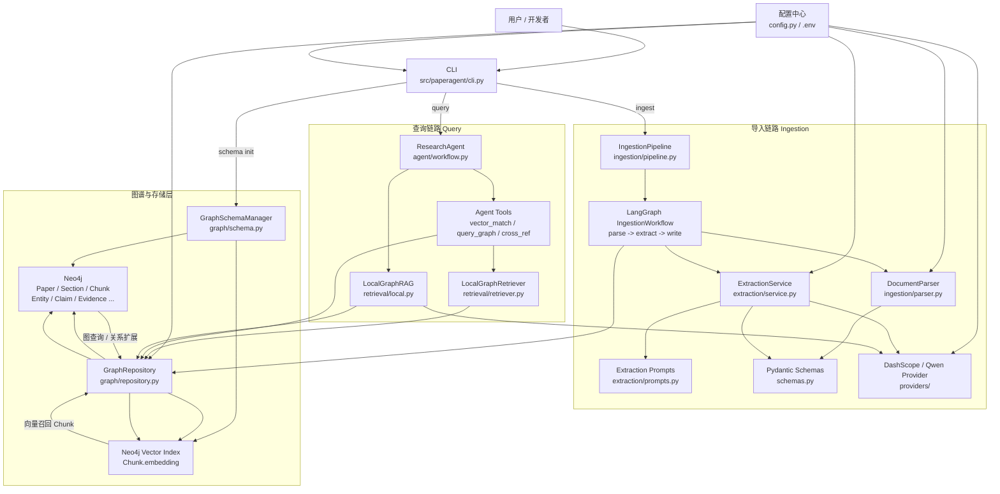

# PaperGraph-Agent 结构图

下面这张图从“用户入口 -> 导入链路 -> 图数据库 -> 查询链路”四个方向，概括了项目当前的整体结构。



## 如何理解这张图

### 1. 用户入口只有一个：CLI

当前项目的实际入口基本都收敛在：

- `paperagent schema init`
- `paperagent ingest`
- `paperagent query`

也就是 [cli.py](/E:/Study/python/PaperAgent/src/paperagent/cli.py)。

### 2. 导入链路由 LangGraph 串起来

导入一篇论文时，核心流程是：

```text
parse -> extract -> write
```

分别对应：

- `DocumentParser`：PDF 解析和 Chunk 切分
- `ExtractionService`：LLM 结构化抽取
- `GraphRepository`：写入 Neo4j

### 3. 图数据库层是整个项目的知识底座

Neo4j 中主要保存两类东西：

- 图节点和关系
  - `Paper`
  - `Section`
  - `Chunk`
  - `Entity`
  - `Claim`
  - `Evidence`
  - `Objective / Approach / Result / Constraint`
- 向量索引
  - `Chunk.embedding`

### 4. 查询链路是“向量检索 + 图谱查询 + Agent”

用户提问后，系统并不是只做一次向量检索，而是：

1. 用 `LocalGraphRetriever` 从向量索引召回相关 `Chunk`
2. 用 `query_graph` / `cross_ref` 等工具扩展图谱上下文
3. 由 `ResearchAgent` 组织最终答案

所以它本质上是一个：

```text
LangChain / LangGraph Agent
+ Neo4j 图谱
+ Neo4j 向量检索
```

的混合系统。

